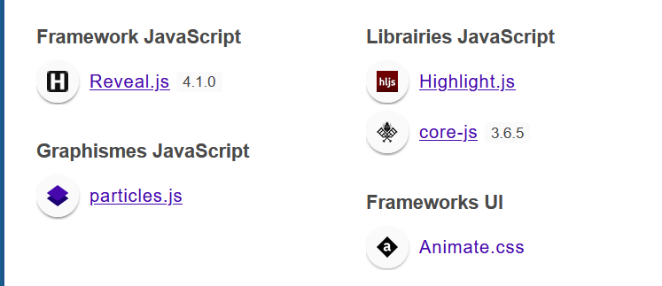

#PRESENTATION SUR LE WEB

Ayant marre de réaliser mes présentations avec PowerPoint, surtout proposé de nouvelles animations personnaliées, j'ai testé plein de framework js.

Ce travail constitue l'ensemble de mes présentations au format web :
* HTML, 
* CSS,
* JAVASCRIPT.

J'ai utilisé le framework <strong><a href="https://revealjs.com/" target="_blank" rel="noreferrer">revealjs</a></strong> pour le moteur des slides.

J'ai utilisé  d'autres libraires pour manipuler des animations à mes goûts :

Concernant les images des nuages de mots, vous avez cette application qui produit des images au format <strong>SVG</strong> pour faciliter le responsive design.

<strong><a href="https://jerosweb.com/05_nuage_mots/" target="_blank" rel="noreferrer">Application : Nuage des mots</a></strong>

##BON USAGE
#Merci
